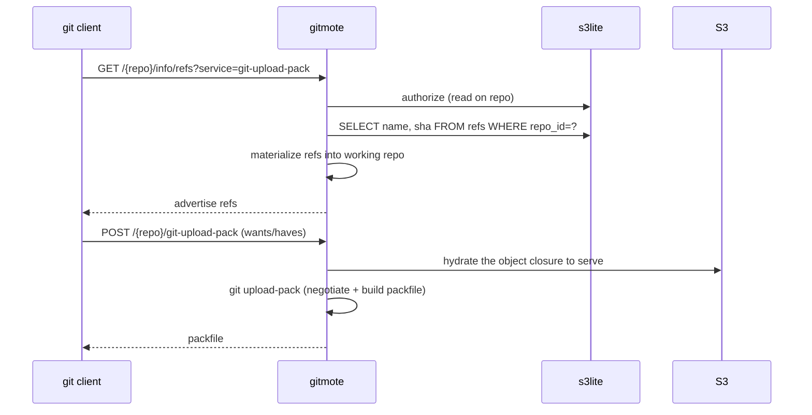
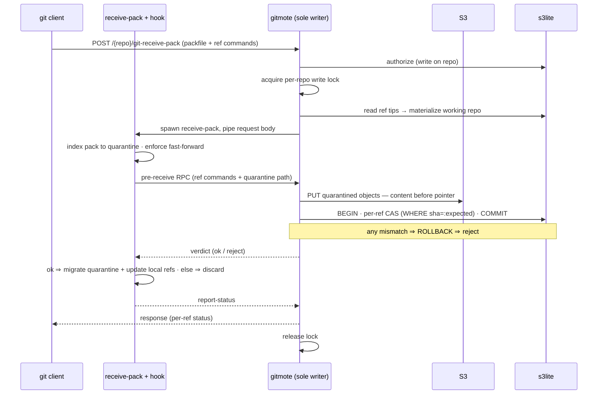

# gitmote — Architecture

A tiny single-container Go server that speaks git's smart-HTTP protocol, stores
repositories in S3-compatible object storage, and keeps its mutable metadata
(refs, users, keys, access) in [s3lite](https://github.com/atmin/s3lite)
(SQLite with S3-backed durability). The container itself is disposable — all
durable truth lives in S3 + s3lite — so it runs as a **single writer that scales
to zero**: it wakes on a request, serves, and idles back down.

Built for self-hosting a handful of repos, with the door open to invite a few
collaborators and to accept commits authored through a web UI. It is explicitly
**not** trying to be GitHub at scale.

Design priorities, in order: **safe → simple → cheap-to-idle → fast.** Where
they conflict, the earlier one wins. Pragmatic beats pure.

---

## The core idea: split git's data by mutability

"Git on S3" is easy except for one thing — **atomic ref updates under
concurrent writers**. Everything else is either immutable or single-writer-safe.
So we split git's storage along the axis that decides which store each half
wants, and we let _real git_ do the parts that are hard to reimplement:

| Data                                                                   | Property                                            | Store                                                                 |
| ---------------------------------------------------------------------- | --------------------------------------------------- | --------------------------------------------------------------------- |
| Objects & packs                                                        | Immutable, content-addressed, bulky (~90% of bytes) | **Plain S3** — synchronous PUT, re-PUT of the same hash is idempotent |
| Refs, users, keys, ACLs, repo registry, web-edit state                 | Small, mutable, need transactional CAS              | **s3lite** — a ref update is one SQL transaction                      |
| Everything git actually computes (packing, negotiation, merge-base, …) | Hard to reimplement correctly                       | **Stock `git`** on ephemeral local disk                               |

The payoff: the single genuinely-hard problem collapses into a one-line SQL
compare-and-swap, on a database already trusted in production — plain SQLite (via
s3lite) — with no database to operate.

---

## Components

```
┌──────────────────────────────────────────────────────────────┐
│  gitmote container (Go, single writer)                       │
│                                                              │
│   HTTP  ─┬─ smart-HTTP handler ── spawns ── git http-backend │
│          │                                    (stock git)    │
│          ├─ web UI (repos, keys, ACLs, doc edits)            │
│          └─ embedded s3lite (*sql.DB)                        │
│                                                              │
│   ephemeral disk: working bare repos (a CACHE, disposable)   │
└───────────┬─────────────────────────────────┬────────────────┘
            │ objects / packs                 │ WAL replication (litestream)
            ▼                                 ▼
      ┌───────────┐                     ┌───────────┐
      │    S3     │                     │  S3 (WAL) │  ← s3lite's backup target
      │ objects/  │                     └───────────┘
      │ lfs/      │
      └───────────┘
```

- **The container (Go).** Wraps `git http-backend` (the CGI program bundled with
  git that implements the entire smart-HTTP protocol — via Go's stdlib
  `net/http/cgi`), serves the web UI, and embeds s3lite as an `*sql.DB`.
- **S3.** Immutable git objects and packfiles.
- **s3lite.** Refs and all forge metadata. Source of truth for refs.
- **Ephemeral local disk.** A working bare repo per accessed repository — a
  **materialization / cache**, never the source of truth. Refs always come from
  s3lite; objects are hydrated from S3 into the closure an operation needs — a
  **write** hydrates the target branch's full history (fast-forward and
  connectivity checks demand it), a **read** hydrates the closure it must serve.
  On eviction or cold start the repo is simply rebuilt.

---

## Storage layout

### S3 (immutable — _content before pointer_)

Mirrors the on-disk bare repo's immutable directories, per repo prefix. Refs are
deliberately **excluded** — they live in s3lite.

| Prefix                                   | Contents                                         |
| ---------------------------------------- | ------------------------------------------------ |
| `{repo}/objects/…`                       | Loose git objects (git's own `ab/cdef…` fan-out) |
| `{repo}/objects/pack/pack-*.pack` `.idx` | Packfiles + indexes                              |
| `lfs/{repo}/{oid}`                       | Large-file blobs (deferred — see Open questions) |

Sync is done with the S3 SDK directly (single static binary, no external
dependency); `rclone` is a zero-code fallback. New objects/packs are PUT after
`receive-pack`; on fetch, missing objects are pulled on demand.

### s3lite schema (mutable — the reason s3lite is here)

```sql
CREATE TABLE repos (
  id             INTEGER PRIMARY KEY,
  name           TEXT NOT NULL UNIQUE,          -- "atmin/dotfiles"
  default_branch TEXT NOT NULL DEFAULT 'main',
  created_at     TEXT NOT NULL
);

-- the mutable pointers — the whole reason this DB exists in the design
CREATE TABLE refs (
  repo_id    INTEGER NOT NULL REFERENCES repos(id),
  name       TEXT NOT NULL,                      -- "refs/heads/main"
  sha        TEXT NOT NULL,                       -- object id
  updated_at TEXT NOT NULL,
  PRIMARY KEY (repo_id, name)
);

CREATE TABLE users (
  id         INTEGER PRIMARY KEY,
  handle     TEXT NOT NULL UNIQUE,
  created_at TEXT NOT NULL
);

CREATE TABLE tokens (                             -- HTTP personal access tokens
  id         INTEGER PRIMARY KEY,
  user_id    INTEGER NOT NULL REFERENCES users(id),
  hash       TEXT NOT NULL,                       -- hash of the PAT, never the raw token
  label      TEXT,
  created_at TEXT NOT NULL,
  last_used  TEXT
);

CREATE TABLE ssh_keys (                           -- deferred transport, schema ready
  id         INTEGER PRIMARY KEY,
  user_id    INTEGER NOT NULL REFERENCES users(id),
  pubkey     TEXT NOT NULL,                        -- OpenSSH authorized_keys line
  label      TEXT,
  created_at TEXT NOT NULL
);

CREATE TABLE acls (
  repo_id    INTEGER NOT NULL REFERENCES repos(id),
  user_id    INTEGER NOT NULL REFERENCES users(id),
  perm       TEXT NOT NULL CHECK (perm IN ('read','write','admin')),
  PRIMARY KEY (repo_id, user_id)
);
```

`HEAD` is not a row — it derives from `repos.default_branch`. Every `refs` row
holds a concrete object id; symbolic refs beyond `HEAD` are not stored.

---

## Request flows

### Clone / fetch (read path)

No lock. Refs come from s3lite; the object closure to serve is hydrated from S3.



### Push (write path) — the CAS

Serialized by a per-repo in-process mutex; the safety-critical ordering is
**objects durable in S3 first, ref CAS in s3lite second.** The catch that shapes
everything below: `git receive-pack` updates refs and acknowledges the client
_itself_, at the end of its run — so the durable commit cannot happen _after_ it
returns (the ack has already gone out). It must gate _inside_ receive-pack's
lifecycle, at its one designed seam: the `pre-receive` hook.



**Why it looks like this:**

- **`pre-receive` is the transaction boundary.** It fires with every
  `<old> <new> <ref>` command before any ref changes, while the pushed objects
  sit in a quarantine dir (`$GIT_QUARANTINE_PATH`). Exit non-zero and git rejects
  the whole push and throws the quarantine away — so a failed S3 PUT or CAS
  leaves nothing behind. Quarantine also isolates _exactly_ the new objects, so
  "PUT the new objects" is simply "PUT the quarantine contents."
- **The hook can't touch s3lite directly.** It runs as a child of
  `receive-pack` — a _separate process_ — and s3lite is single-writer SQLite
  embedded in the parent. Two processes writing it is the one thing s3lite
  forbids. So the hook RPCs back to the parent over a unix socket; the parent,
  the sole writer, performs the PUT + CAS and returns a verdict. (This is exactly
  how GitLab/Gitaly wires its git hooks back to the app.)
- **One SQL transaction = atomic multi-ref push.** All per-ref CAS run inside a
  single s3lite transaction; all-or-nothing matches `git push --atomic`, and is
  _stronger_ than loose-file refs.
- **The local refs are a throwaway.** On an `ok` verdict, receive-pack migrates
  the quarantine and updates on-disk refs — bookkeeping on disposable disk;
  durability is S3 + s3lite. Note the fast-forward / ancestry check needs the
  target branch's history present locally, which is why a _write_ hydrates that
  history up front (and is the scaling wall for large repos).

---

## Concurrency & safety model

**"Safe" is a hard requirement.** The model rests on four points:

1. **Single writer = single _container_, not single _user_.** s3lite requires
   exactly one writer instance; that's a deployment fact, not a limit on
   collaborators. A few invited users and the web UI's service commits all funnel
   into one container. This suits the scale-to-zero shape: 0↔1 instances is fine.
   **The one operational rule: never run two writer instances** — no overlapping
   deploys of the writer.

2. **In-process mutex linearizes writes.** Git's own lockfiles can't be trusted
   across a synced/object backend, so a per-repo mutex in the process does the
   linearization. At "a few users," contention is ~zero. (This is the
   "in-process now, shared coordination later" pattern — the mutex is the
   linearization point today; the SQL CAS below keeps the door open to relax the
   single-writer assumption later without changing the storage contract.)

3. **The ordering invariant — content before pointer.** Objects are made durable
   in S3 _before_ the ref CAS in s3lite. Get this right and the only failure mode
   is unreferenced objects in S3 — harmless garbage that `gc` reclaims. Get it
   backwards and you can get a ref pointing at a missing object, the one true
   corruption. So: **always PUT objects, then advance the ref.**

4. **s3lite's write-loss window is accepted, and it's benign for git.** litestream
   replicates the SQLite WAL to S3 _asynchronously_ — a committed ref update can
   be lost if the container dies within a sub-second window. Because of the
   ordering above, the loss direction is always objects-without-a-ref (garbage),
   **never** ref-without-an-object (corruption). To the user it's a lost
   _acknowledgment_: the client still holds its commits, re-push is cheap (objects
   already uploaded), and `gc` sweeps the orphans. For git — content-addressed and
   idempotent — this is self-healing in a way a ledger isn't, so we accept it.
   (Escape hatch if ever needed: move _refs_ to plain S3 behind a synchronous
   conditional-PUT CAS, keeping only softer metadata in s3lite.)

---

## Auth & transport

- **Smart HTTP first.** `git http-backend` over HTTPS, authenticated with
  bearer **personal access tokens** (hashed in `tokens`). Stateless, firewall-
  friendly, and the natural fit for a scale-to-zero container.
- **Authorization is per-repo**, read from `acls` on every request.
- **SSH is deferred.** It's the expected forge UX and the `ssh_keys` schema is
  already there, but an SSH connection is stateful — awkward for a container that
  sleeps. Revisit once HTTP is solid.

---

## Rejected / deferred alternatives

- **Dumb HTTP remote** (S3 as a static git remote). No smarts needed for fetch,
  but no protocol negotiation (transfers too much) and awkward pushes. Too weak
  for "instead of GitHub."
- **S3 as a filesystem** (`s3fs`, `mountpoint-s3`, JuiceFS). The mounts simple
  enough to stay tiny lack the atomic rename git relies on (`mountpoint-s3`
  historically had no rename at all); JuiceFS provides real POSIX but needs its
  own metadata service — no longer tiny; `rclone mount --vfs-cache-mode full`
  works only by caching to local disk and writing back, which _is_ this design in
  disguise.
- **Native S3 object backend** (JGit DFS / gitoxide ODB). The "pure" version —
  git objects/packs served straight from S3 with no local materialization. Proven
  on the JVM (Gerrit), but overkill at this scale, and gitoxide's server side is
  still immature. Running stock git on ephemeral disk buys correctness for free.

---

## Open questions

Items with worked-out context live as one-concern notes under
[`docs/notes/`](docs/notes/); the rest stay one-liners until they earn a note.

- **The push hook channel.** How the `pre-receive` hook discovers and
  authenticates to the parent's socket, and how it is installed into ephemeral
  repos — [notes/push-hook-channel.md](docs/notes/push-hook-channel.md).
- **Object hydration for reads.** `upload-pack` walks a _local_ object store, so
  the closure must be present before it runs ("on demand" doesn't apply at the
  git layer); full-hydrate vs partial-clone/promisor —
  [notes/object-hydration.md](docs/notes/object-hydration.md).
- **Bootstrap.** Creating the first admin, token, and repo from an empty bucket —
  [notes/bootstrap.md](docs/notes/bootstrap.md).
- **gc / compaction.** Loose objects proliferate; a `cleanup` subcommand
  (triggered by loose-object count) repacks and prunes orphans. Pruning must not
  race in-flight reads — a fetch pins a ref snapshot from s3lite and pushes only
  _add_ objects, so reads are safe against pushes, but _deletion_ is not; the
  sweep needs a grace window or liveness check.
- **Git-LFS.** Large blobs via presigned PUT to `lfs/{repo}/{oid}` — schema slot
  reserved above.
- **Web-authored commits.** How the service constructs a commit from a web edit:
  build the tree/commit objects and drive them through the same
  `receive-pack → CAS` path, vs. a direct object-write + CAS shortcut.
- **Closing the litestream window for refs** — only if the accepted lost-ack
  behaviour ever proves unacceptable (see safety §4).
- **Read scaling.** One container serves reads and writes today; litestream read
  replicas are the later answer if reads get heavy.
