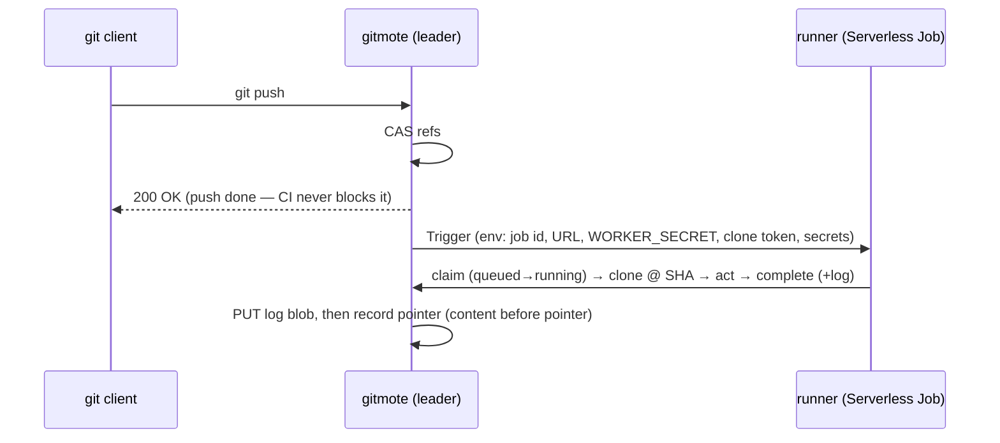

# gitmote — CI

Run a repo's `.gitmote/workflows` on push: on a successful ref advance, execute
the workflow in an isolated container, keep logs, report pass/fail, surface
status in the UI. Deliberately **limited but real** — the ~80% of personal CI
that is "on push, run steps in a container, pass/fail, keep logs." No matrix
builds, marketplace, service containers, or caching.

The engine is **[`act`](https://github.com/nektos/act)**: it runs
GitHub-Actions YAML, so a workflow authored for Actions runs unmodified under
gitmote's runner. Actions-compat is load-bearing (the GitHub mirror is
break-glass — move the same YAML to `.github/workflows` and GitHub runs it), not
a preference.

**Why `.gitmote/workflows`, not `.github/workflows`.** GitHub only ever reads
`.github`, so the directory a workflow lives in *declares which forge runs it*: a
repo mirrored to GitHub puts CI in `.gitmote` to run only here, in `.github` to
run only on GitHub, and so never double-runs on both. (gitmote's own repo keeps
its deploy pipeline in `.github` and therefore never CI's on gitmote — the
concrete case that motivated this.) `act` reads the directory via `--workflows`;
the YAML is byte-identical to GitHub's, so moving a file between the two
directories is the whole switch.

## Pipeline

The trigger is the **ref CAS commit** ([request-flows.md](request-flows.md)) —
the one durable "a ref advanced" moment. After it succeeds, an **after-commit**
callback dispatches, **fire-and-forget**: a dispatch failure is a *missed run,
not a failed push* (content-before-pointer, generalized).

The runner ([`internal/runner`](../../internal/runner)) is one linear pass:
**claim → clone → act → complete**. It holds only a scoped clone token and
injected secrets, reports over the authenticated API, and **never touches s3lite
or S3 directly**.

## One runner, three substrates

The runner code and env contract are identical everywhere; only what *starts* a
job differs, selected at boot ([`cmd/gitmote/main.go`](../../cmd/gitmote/main.go)):

| Condition | Trigger | Runs where |
| --- | --- | --- |
| `SCW_CI_JOB_DEFINITION_ID` set | Scaleway Serverless Jobs ([`internal/scaleway`](../../internal/scaleway)) | Cloud (ephemeral, scale-to-zero Job) |
| `GITMOTE_URL` + `WORKER_SECRET` set | `LocalTrigger` — execs the runner binary locally | Dev machine (`make dev`) |
| neither | `NoopTrigger` | Nowhere — runs record in the UI but don't execute |

So `make dev` exercises the whole path locally — same runner, same API, same
`act`. Cloud also requires `WORKER_SECRET` + `GITMOTE_URL` or the server refuses
to start (a trigger the runner can't report back to is a misconfiguration).

**`act` runs self-hosted on Scaleway, nested locally.** Serverless Jobs have no
Docker daemon, so on the cloud runner `act` runs in self-hosted mode
(`GITMOTE_ACT_PLATFORMS` in [`Dockerfile.runner`](../../Dockerfile.runner)):
steps execute *directly in the ephemeral Job container* — the Job **is** the
sandbox, no Docker-in-Docker. Every tool a workflow needs (git, node, bash) must
live in the runner image. Locally, where a real daemon exists, that var is unset
and `act` keeps its default nested-container behavior.

## Data model

Three leader-only, litestream-replicated tables in
[`internal/meta`](../../internal/meta): `ci_runs`, `ci_jobs`, `ci_secrets`. Logs
are append-only blobs under a `ci/` key space within the storage root
(`ci/{repoID}/{runID}/{jobID}.log`), PUT before the `ci_jobs` pointer is
recorded, with a size cap (explicit truncation marker, never silent).

The runner-facing report API lives under `/internal`, apart from the browser UI
([`internal/ci/report.go`](../../internal/ci/report.go)):
`GET /internal/ci/jobs/{id}` claims a job (`queued→running`),
`POST …/complete` uploads the log and sets a terminal status (idempotent). Both
do a constant-time `WORKER_SECRET` compare; only the **leader** writes
completions (a follower returns a retryable 503). A leader-only reconcile ticker
sweeps jobs stuck in `running` to `error`.

## Secrets

Per-repo CI secrets, encrypted at rest, decrypted only to inject at trigger. The
crypto and its **narrow** threat model are in [safety.md §5](safety.md):
AES-256-GCM under a server-held master key (`GITMOTE_CI_SECRET_KEY_V<n>`), a
per-repo HKDF subkey, AAD binding `(repoID, name, version)`. It protects against
a leaked S3 replica / DB snapshot — *not* a compromised running server, which
must hold the key to decrypt. The dispatcher passes each secret as
`GITMOTE_CI_SECRET_<NAME>`; the runner forwards it to `act` as `-s <NAME>`, which
reads the value from its env — so the value never touches the `act` argv and the
workflow sees `${{ secrets.NAME }}` as on GitHub. Values are write-only in the UI
(only names shown) and never logged.

**Env-seeded secrets (a second source).** Beside the encrypted UI/DB secrets, the
dispatcher overlays any per-repo secrets supplied in the server's own environment
as `GITMOTE_REPO_SECRET_<REPO>__<NAME>` (repo uppercased, `-`→`_`). These are
plain operator config — never stored, never encrypted, and needing **no master
key** — so they're invisible to the UI and win over a same-named DB secret. The
host env is already the CI trust boundary ([safety.md §7](safety.md)), so this
adds no exposure; it exists so the automated self-deploy (`make self-deploy`) can
carry its Scaleway/GHCR secrets in a gitignored `.env` instead of the UI.

## Clone auth

The runner clones over ordinary git-HTTPS with a **per-run, read-only,
repo-scoped, expiring token** minted by the leader at dispatch — the same
authenticated path as any client, no CI backdoor. It checks the SHA out onto its
branch (`checkout -B`) so `github.ref` resolves.

## Safety

- **Untrusted code execution** — repo workflows are attacker-controlled; the
  **Serverless Job is the isolation boundary**. The writer never runs repo code;
  the runner can't reach s3lite or S3.
- **Fire-and-forget** — dispatch and trigger never fail or block a push.
- **Single writer holds** — only the leader dispatches and writes run state.

## Container image builds

Image builds are **substrate-dependent**, and off by default:

- **Scaleway (cloud) cannot build.** The Serverless Job sandbox has no user
  namespaces and drops the capabilities image builders need — `docker build`,
  `buildah`, `podman build`, and kaniko-as-a-step all fail. On the cloud runner CI
  can compile, test, lint, and produce file artifacts in any language, but
  **cannot** build an OCI image; such a step must run on the GitHub mirror (a real
  builder), or use registry-API assembly (`ko`/`crane`) for the static-binary case.
- **Local/VPS *can* build, behind an opt-in.** On a daemon-backed host `act` runs
  in nested mode, and it mounts the host Docker socket into each job container by
  default — so `docker build` reaches the daemon. Because that hands **untrusted
  workflow code the daemon (host root)**, gitmote suppresses the mount
  (`act --container-daemon-socket -`) unless **`GITMOTE_CI_ALLOW_BUILDS`** is
  truthy. Turn it on only for **trusted repos** on a host you control. With it on,
  gitmote builds container images — including its own — locally or on a VPS.
  Runtime is selected by `DOCKER_HOST`: Docker works out of the box; podman needs
  its API socket service running (`podman system service`) and `DOCKER_HOST`
  pointed at it — a truly daemonless podman can't back `act` at all. When builds
  are on, gitmote mounts the **daemon-side** socket path (`/var/run/docker.sock`,
  override `GITMOTE_ACT_DAEMON_SOCKET`) rather than let `act` derive the mount from
  `DOCKER_HOST` — for a **VM-backed daemon** (colima, Docker Desktop on macOS)
  `DOCKER_HOST` is a host path the in-VM daemon can't resolve, so the socket mount
  would fail. See [ops.md](../ops.md).

  > **No daemon → every run fails visibly.** `act` needs a reachable Docker/podman
  > daemon to spawn job containers. On a host without one each CI job is still
  > dispatched and recorded, but fails at act's "Set up job" step — the log reads
  > `failed to connect to the docker API … check if … the daemon is running`, and
  > the run is marked failed (`ActEngine.Run` → `passed=false`). No workflow step,
  > and no build, executes. The build opt-in only matters where a daemon exists.

## Limitations

- **gitmote does not deploy itself on Scaleway; it *can* locally (break-glass).**
  The cloud self-deploy loop (a green `master` run rebuilding gitmote's own image
  in-Job) was evaluated and **dropped** — the Serverless Job can't build (above).
  Production deployment stays on **GitHub Actions**
  ([`.github/workflows/ci.yml`](../../.github/workflows/ci.yml)): build+push the
  public image to GHCR (`ghcr.io/atmin/gitmote`), then `scw container update` to
  pull it; the leased writer keeps the swap safe (see [ops.md](../ops.md)). The
  GitHub mirror is the everyday deployer.

  A **local** instance, though, is a real builder, so gitmote now closes the loop
  as a **break-glass fallback**, automated by `make self-deploy`: it runs a
  throwaway instance with `GITMOTE_CI_ALLOW_BUILDS` on, seeds the deploy secrets
  from a gitignored `.env` (per-repo, via `GITMOTE_REPO_SECRET_<REPO>__<NAME>` —
  never stored, no master key needed), and pushes `HEAD` to `self-deploy`. That
  triggers [`.gitmote/workflows/deploy.yml`](../../.gitmote/workflows/deploy.yml) —
  the GitHub deploy job, gated on `self-deploy` instead of `master` — to build the
  amd64 image, push it to GHCR, and run the same `scw container update`. Confined to
  the `self-deploy` branch, it never overlaps the GitHub path (no double-deploy),
  and the same writer lease makes its rolling swap safe. It is a fallback for when
  the GitHub deployer is unavailable, not the primary route. See
  [ops.md](../ops.md).
- **The runner image is built by CI**, not by hand: a change to
  [`Dockerfile.runner`](../../Dockerfile.runner) or the runner source on `master`
  (or a release) publishes `ghcr.io/atmin/gitmote-runner` publicly via
  [`.github/workflows/publish-runner.yml`](../../.github/workflows/publish-runner.yml).
  The Scaleway Job definition references that GHCR image and pulls it anonymously.
