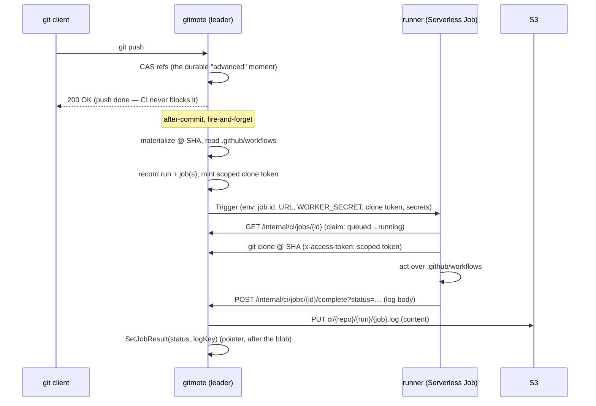

# gitmote — CI

Run a repo's `.github/workflows` on push: on a successful ref advance, execute
the workflow in an isolated container, keep logs, report pass/fail, and surface
status in the UI. Deliberately **limited but real** — the ~80% of personal CI
that is "on push, run steps in a container, pass/fail, keep logs." No matrix
builds, marketplace, service containers, caching, or OIDC.

The strategic payoff is **inverting the source of truth**: S3 + gitmote become
the origin, GitHub a mirror — and, once the [self-deploy loop](#not-yet-closed-the-self-deploy-loop)
closes, a push can redeploy gitmote itself, made safe by the leased writer
([safety.md §1](safety.md)).

The engine is **[`act`](https://github.com/nektos/act)**: it runs GitHub-Actions
YAML, so **one** workflow definition runs both self-hosted *and* on the GitHub
mirror, and the break-glass redeploy uses the same workflow. Actions-compat is
load-bearing, not a preference.

---

## The pipeline, end to end

CI doesn't bolt on — it hangs off primitives already built. The trigger is the
**ref CAS commit** ([request-flows.md](request-flows.md), the push path): the one
durable "a ref advanced" moment. After `CASRefs` succeeds, an **after-commit**
callback dispatches — **fire-and-forget**, so a dispatch failure is a *missed
deploy, not a failed push* (content-before-pointer, generalized).

The runner ([`cmd/gitmote-runner`](../../cmd/gitmote-runner), [`internal/runner`](../../internal/runner))
is one linear pass: **claim → clone → engine → complete**. It holds only a scoped
clone token and injected secrets, reports over the authenticated API, and **never
touches s3lite or S3 directly** — same discipline as the push-hook channel.

---

## One runner, three substrates

The runner code and its env contract are identical everywhere; only *what starts
the job* differs. Selected at boot from the environment
([`cmd/gitmote/main.go`](../../cmd/gitmote/main.go)):

| Condition | Trigger | Where the job runs |
| --- | --- | --- |
| `SCW_CI_JOB_DEFINITION_ID` set | Scaleway Serverless Jobs ([`internal/scaleway`](../../internal/scaleway)) — one `POST …/job-definitions/{id}/start` with per-run env | Cloud — an ephemeral, scale-to-zero Job |
| `GITMOTE_URL` + `WORKER_SECRET` set | `LocalTrigger` ([`internal/ci`](../../internal/ci)) — execs the runner binary as a detached local process | The dev machine (`make dev`) |
| neither | `NoopTrigger` | Nowhere — runs still **record** in the UI, but nothing executes |

This is why `make dev` exercises the *entire* CI path locally with no cloud
account: same runner, same claim/clone/complete API, same `act` — only the
substrate is a local process instead of a Serverless Job. Cloud requires
`WORKER_SECRET` and `GITMOTE_URL` too, or the server **refuses to start** (a
Scaleway trigger with no way for the runner to report back is a misconfiguration,
not a degraded mode).

### Why `act` runs *self-hosted* on Scaleway — and nested locally

`act` normally runs each job by nesting a per-job container via a local Docker
daemon. **Scaleway Serverless Jobs have no Docker daemon** — so on the cloud
runner, `act` runs in **self-hosted mode** (`-P ubuntu-latest=-self-hosted`, set
by `GITMOTE_ACT_PLATFORMS` in [`Dockerfile.runner`](../../Dockerfile.runner)):
the workflow steps execute *directly in the Job container*. The Job is a fresh,
ephemeral, scale-to-zero container, so **the Job itself is the sandbox** — no
Docker-in-Docker. The corollary: every tool a workflow needs (git, node, bash)
must live in the runner image.

Locally (`make dev`), where a real daemon exists (Docker or podman),
`GITMOTE_ACT_PLATFORMS` is unset and `act` keeps its default nested-container
behavior, unchanged. One binary, two isolation strategies, chosen by one env var.

> This is the one place the shipped design diverges from the CI epic's original
> sketch, which assumed the runner substrate offered "a real Docker daemon."
> Serverless Jobs don't; self-hosted `act` is the resolution.

---

## Data model

Three s3lite tables in [`internal/meta`](../../internal/meta), written **only by
the leader** (like refs), litestream-replicated like everything else:

- `ci_runs` — one row per dispatched run (repo, ref, SHA, status).
- `ci_jobs` — one row per workflow file in the run (name, status, log pointer).
- `ci_secrets` — the sealed per-repo secret envelopes (see [Secrets](#secrets)).

Logs are append-only blobs in the object store under a top-level `ci/` key space
(peer of `objects/` and `meta/`): `ci/{repoID}/{runID}/{jobID}.log`. The runner
POSTs the complete log on completion; the server PUTs the blob, then records the
pointer in `ci_jobs` — **content before pointer**, unchanged from the git write
path. Logs aren't sacred (a re-run regenerates them), so they need no
litestream-grade durability; living in the same durable bucket is enough. A
per-log size cap truncates a runaway log with an explicit marker, never silently.

### The internal report API

Two routes, mounted **outside** `/ui` (these are runner-facing, not
browser-facing) in [`internal/ci`](../../internal/ci/report.go):

| Route | Purpose |
| --- | --- |
| `GET /internal/ci/jobs/{id}` | Claim: atomically flip `queued → running`, return the job spec (repo, SHA, ref, workflow dir). Not claimable (absent / already claimed / terminal) → 404. |
| `POST /internal/ci/jobs/{id}/complete?status=…` | Upload the log body, set the terminal status. **Idempotent** — a double-POST is a no-op. |

Both authenticate with a constant-time compare against `WORKER_SECRET`. Only the
**leader** may write completions; a follower returns a retryable 503. A
leader-only **reconcile ticker** sweeps jobs stuck in `running` (a runner that
died mid-run) to a terminal `error` after a max age.

---

## Secrets

Per-repo CI secrets, encrypted at rest, decrypted only to inject into the runner
env at trigger. The crypto and its **narrow** threat model live in
[safety.md §5](safety.md): AES-256-GCM under a **server-held** master key
(`GITMOTE_CI_SECRET_KEY_V<n>`), a per-repo subkey via HKDF-SHA256, and AAD
binding `(repoID, name, version)`. Encryption-at-rest buys exactly one thing — a
compromise of the S3 replica / DB snapshot doesn't leak values — and is
explicitly *not* a defense against a compromised running server, which must hold
the key to decrypt. Values are write-only in the UI (only names are shown) and
never logged.

Injection is deliberately indirect. The dispatcher puts each secret in the job
env as `GITMOTE_CI_SECRET_<NAME>`; the runner strips the prefix and forwards it to
`act` as `-s <NAME>`, which reads the **value from its own environment** — so the
secret value never touches the `act` argv, and multiline values survive. The
workflow sees it as `${{ secrets.NAME }}`, exactly as on GitHub.

> This indirection was earned the hard way: `act` does not forward the host env
> into job containers, so a naive "set it in the environment" leaks nothing *and*
> delivers nothing. The `-s NAME` hand-off is what actually reaches the workflow.

---

## Clone auth

The runner clones over ordinary git-HTTPS with a **per-run, read-only,
repo-scoped, short-lived token**, minted by the leader at dispatch
(`https://x-access-token:<tok>@gitmote…/owner/repo`, then checkout the SHA). It's
the **same authenticated path as any client** — no CI backdoor in the git
handler. Rejected alternatives: a `WORKER_SECRET`-derived credential (shared
across all runs → a leak grants broad standing access) and presigned-S3 /
git-bundle hand-off (duplicates the git path and needs broad bucket creds). The
token model gained nullable `expires_at`, a single-repo scope, and a `read_only`
flag to support this — generally useful beyond CI.

To fix `github.ref` inside the workflow, the runner checks the SHA out *onto its
branch* (`checkout -B <branch> <sha>` when the ref is `refs/heads/…`) rather than
leaving a detached HEAD.

---

## Safety

- **Untrusted code execution.** Repo workflows are attacker-controlled. The
  **Serverless Job is the isolation boundary** — the writer never executes repo
  code. The runner holds only a scoped clone token + injected secrets, reports
  over the authenticated API, and cannot reach s3lite or S3.
- **Fire-and-forget everywhere.** Dispatch, trigger, and (eventually) deploy must
  never fail or block a push. A missed run is recoverable; a failed push is not
  acceptable.
- **Single writer holds.** Only the leader dispatches, writes run/job state, and
  applies completions; runners funnel results back through the API. Nothing here
  adds a second writer — so a self-replacing deploy stays safe by construction.
- **Concurrency.** Runs are *dispatched* serially by the single writer (in push
  order) but *execute* in parallel on Scaleway. The MVP does **not** cancel
  in-flight runs; a superseded run runs to completion and correctness comes from
  the latest-wins deploy guard, not from racing to cancel.

---

## Not yet closed: the self-deploy loop

Today gitmote **already redeploys itself** on a green `master` push — via GitHub
Actions ([`.github/workflows/ci.yml`](../../.github/workflows/ci.yml)): build +
push the amd64 image, `scw container container update … --wait`
([ops.md](../ops.md)). The leased writer makes the swap safe: the new image boots
a follower, the old releases the lease on SIGTERM, the new promotes — never two
writers.

The **ouroboros** — gitmote's *own* runner doing that deploy, with GitHub demoted
to break-glass — is the remaining capstone (`tasks/24`). Two pieces stand between
here and there:

1. **Daemonless image builds.** The deploy step is `docker build`, but the
   self-hosted runner has no Docker daemon (that's *why* `act` runs self-hosted).
   Building the image *inside* the Job means nested, rootless `buildah`/`podman`
   (fuse-overlayfs where the sandbox allows it, else the slower `vfs` driver) — a
   spike, not a wall. The fallback is legitimate: keep the deploy on the GitHub
   mirror and let the self-hosted runner do build+test only.
2. **Latest-wins guard.** Rapid pushes race; the lease keeps that *safe*, but a
   slow run could still ship an older SHA after a newer one. The deploy step must
   no-op unless its target SHA is still `master`'s tip in gitmote — a stale run
   deploys nothing. Implemented as a workflow step, so the mirror enforces it too.

Until then, the GitHub-Actions path *is* the deployer (and the break-glass copy).

---

## Operational notes

- **One job definition serves all repos** — created once out of band
  (`scw jobs definition create`); the app injects per-run env at trigger. See
  [ops.md](../ops.md) for the CI env/secrets on the container (`SCW_SECRET_KEY`,
  `SCW_REGION`, `SCW_CI_JOB_DEFINITION_ID`, `WORKER_SECRET`, and the secrets-store
  master key), distinct from the deploy pipeline's GitHub Actions secrets.
- **The runner image is pushed by hand today** (`rg.fr-par.scw.cloud/atmin/gitmote-runner:master`);
  nothing in CI rebuilds it, so a stale runner is easy to forget. Automating that
  build/push is a natural follow-up.
