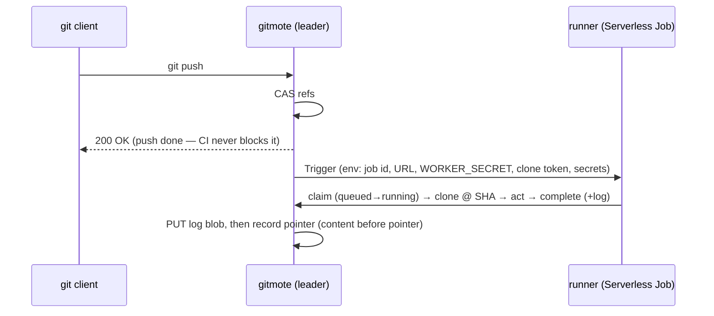

# gitmote — CI

Run a repo's `.github/workflows` on push: on a successful ref advance, execute
the workflow in an isolated container, keep logs, report pass/fail, surface
status in the UI. Deliberately **limited but real** — the ~80% of personal CI
that is "on push, run steps in a container, pass/fail, keep logs." No matrix
builds, marketplace, service containers, or caching.

The engine is **[`act`](https://github.com/nektos/act)**: it runs
GitHub-Actions YAML, so the *same* workflow runs on gitmote's runner and on the
GitHub mirror. Actions-compat is load-bearing (the mirror is break-glass), not a
preference.

## Pipeline

The trigger is the **ref CAS commit** ([request-flows.md](request-flows.md)) —
the one durable "a ref advanced" moment. After it succeeds, an **after-commit**
callback dispatches, **fire-and-forget**: a dispatch failure is a *missed run,
not a failed push* (content-before-pointer, generalized).

The runner ([`internal/runner`](../../internal/runner)) is one linear pass:
**claim → clone → act → complete**. It holds only a scoped clone token and
injected secrets, reports over the authenticated API, and **never touches s3lite
or S3 directly**.

## One runner, three substrates

The runner code and env contract are identical everywhere; only what *starts* a
job differs, selected at boot ([`cmd/gitmote/main.go`](../../cmd/gitmote/main.go)):

| Condition | Trigger | Runs where |
| --- | --- | --- |
| `SCW_CI_JOB_DEFINITION_ID` set | Scaleway Serverless Jobs ([`internal/scaleway`](../../internal/scaleway)) | Cloud (ephemeral, scale-to-zero Job) |
| `GITMOTE_URL` + `WORKER_SECRET` set | `LocalTrigger` — execs the runner binary locally | Dev machine (`make dev`) |
| neither | `NoopTrigger` | Nowhere — runs record in the UI but don't execute |

So `make dev` exercises the whole path locally — same runner, same API, same
`act`. Cloud also requires `WORKER_SECRET` + `GITMOTE_URL` or the server refuses
to start (a trigger the runner can't report back to is a misconfiguration).

**`act` runs self-hosted on Scaleway, nested locally.** Serverless Jobs have no
Docker daemon, so on the cloud runner `act` runs in self-hosted mode
(`GITMOTE_ACT_PLATFORMS` in [`Dockerfile.runner`](../../Dockerfile.runner)):
steps execute *directly in the ephemeral Job container* — the Job **is** the
sandbox, no Docker-in-Docker. Every tool a workflow needs (git, node, bash) must
live in the runner image. Locally, where a real daemon exists, that var is unset
and `act` keeps its default nested-container behavior.

## Data model

Three leader-only, litestream-replicated tables in
[`internal/meta`](../../internal/meta): `ci_runs`, `ci_jobs`, `ci_secrets`. Logs
are append-only blobs under a top-level `ci/` key space
(`ci/{repoID}/{runID}/{jobID}.log`), PUT before the `ci_jobs` pointer is
recorded, with a size cap (explicit truncation marker, never silent).

The runner-facing report API lives outside `/ui`
([`internal/ci/report.go`](../../internal/ci/report.go)):
`GET /internal/ci/jobs/{id}` claims a job (`queued→running`),
`POST …/complete` uploads the log and sets a terminal status (idempotent). Both
do a constant-time `WORKER_SECRET` compare; only the **leader** writes
completions (a follower returns a retryable 503). A leader-only reconcile ticker
sweeps jobs stuck in `running` to `error`.

## Secrets

Per-repo CI secrets, encrypted at rest, decrypted only to inject at trigger. The
crypto and its **narrow** threat model are in [safety.md §5](safety.md):
AES-256-GCM under a server-held master key (`GITMOTE_CI_SECRET_KEY_V<n>`), a
per-repo HKDF subkey, AAD binding `(repoID, name, version)`. It protects against
a leaked S3 replica / DB snapshot — *not* a compromised running server, which
must hold the key to decrypt. The dispatcher passes each secret as
`GITMOTE_CI_SECRET_<NAME>`; the runner forwards it to `act` as `-s <NAME>`, which
reads the value from its env — so the value never touches the `act` argv and the
workflow sees `${{ secrets.NAME }}` as on GitHub. Values are write-only in the UI
(only names shown) and never logged.

## Clone auth

The runner clones over ordinary git-HTTPS with a **per-run, read-only,
repo-scoped, expiring token** minted by the leader at dispatch — the same
authenticated path as any client, no CI backdoor. It checks the SHA out onto its
branch (`checkout -B`) so `github.ref` resolves.

## Safety

- **Untrusted code execution** — repo workflows are attacker-controlled; the
  **Serverless Job is the isolation boundary**. The writer never runs repo code;
  the runner can't reach s3lite or S3.
- **Fire-and-forget** — dispatch and trigger never fail or block a push.
- **Single writer holds** — only the leader dispatches and writes run state.

## Limitations

- **No container builds in CI.** The Serverless Job sandbox has no user
  namespaces and drops the capabilities image builders need — `docker build`,
  `buildah`, `podman build`, and kaniko-as-a-step all fail. CI can compile, test,
  lint, and produce file artifacts in any language (node, rust, go, …); it
  **cannot** build an OCI image. A workflow that builds+pushes an image must do
  that step on the GitHub mirror (a real builder), or use registry-API assembly
  (`ko`/`crane`) for the rare static-binary case. Making arbitrary image builds
  work in-CI would need a build-capable substrate (a VM with a daemon), a
  separate effort.
- **gitmote does not deploy itself.** The self-deploy loop (a green `master` run
  rebuilding gitmote's own image in-Job) was evaluated and **dropped** — it runs
  straight into the limitation above. Deployment stays on **GitHub Actions**
  ([`.github/workflows/ci.yml`](../../.github/workflows/ci.yml)): build+push the
  image, `scw container update`; the leased writer keeps the swap safe (see
  [ops.md](../ops.md)). The GitHub mirror is deployer and break-glass both.
- **The runner image is pushed by hand** (`gitmote-runner:master`); nothing in CI
  rebuilds it.
