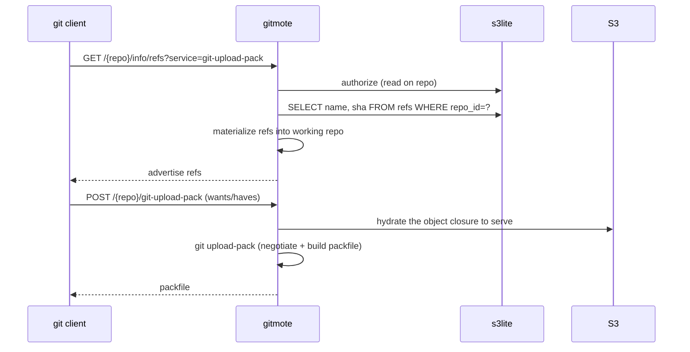
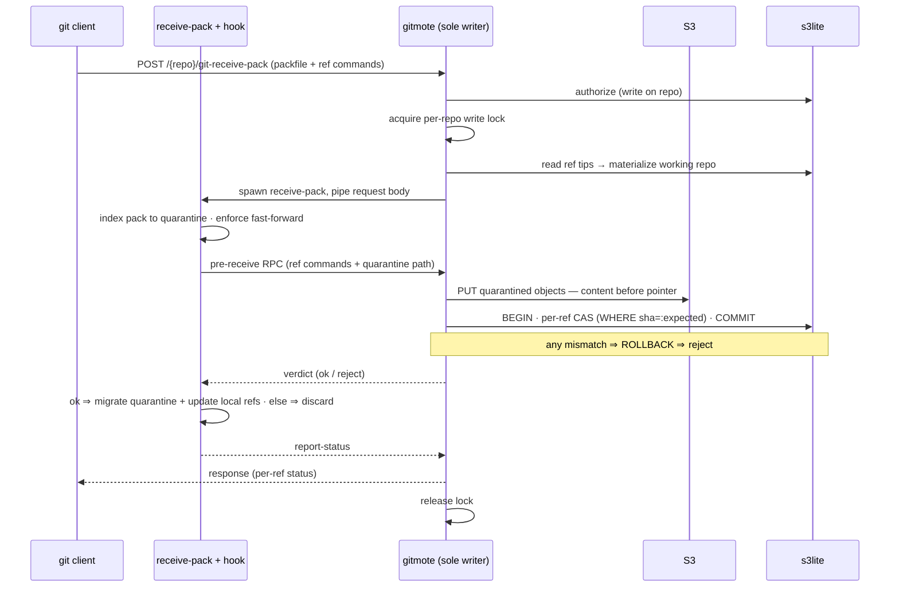

# Request flows

> Part of the [gitmote architecture](README.md).

## Clone / fetch (read path)

No lock. Refs come from s3lite; the object closure to serve is hydrated from S3.

## Push (write path) — the CAS

Serialized by a per-repo in-process mutex; the safety-critical ordering is
**objects durable in S3 first, ref CAS in s3lite second.** The catch that shapes
everything below: `git receive-pack` updates refs and acknowledges the client
_itself_, at the end of its run — so the durable commit cannot happen _after_ it
returns (the ack has already gone out). It must gate _inside_ receive-pack's
lifecycle, at its one designed seam: the `pre-receive` hook.

**Why it looks like this:**

- **`pre-receive` is the transaction boundary.** It fires with every
  `<old> <new> <ref>` command before any ref changes, while the pushed objects
  sit in a quarantine dir (`$GIT_QUARANTINE_PATH`). Exit non-zero and git rejects
  the whole push and throws the quarantine away — so a failed S3 PUT or CAS
  leaves nothing behind. Quarantine also isolates _exactly_ the new objects, so
  "PUT the new objects" is simply "PUT the quarantine contents."
- **The hook can't touch s3lite directly.** It runs as a child of
  `receive-pack` — a _separate process_ — and s3lite is single-writer SQLite
  embedded in the parent. Two processes writing it is the one thing s3lite
  forbids. So the hook RPCs back to the parent over a unix socket; the parent,
  the sole writer, performs the PUT + CAS and returns a verdict. (This is exactly
  how GitLab/Gitaly wires its git hooks back to the app.)
- **One SQL transaction = atomic multi-ref push.** All per-ref CAS run inside a
  single s3lite transaction; all-or-nothing matches `git push --atomic`, and is
  _stronger_ than loose-file refs.
- **The local refs are a throwaway.** On an `ok` verdict, receive-pack migrates
  the quarantine and updates on-disk refs — bookkeeping on disposable disk;
  durability is S3 + s3lite. Note the fast-forward / ancestry check needs the
  target branch's history present locally, which is why a _write_ hydrates that
  history up front (and is the scaling wall for large repos).
